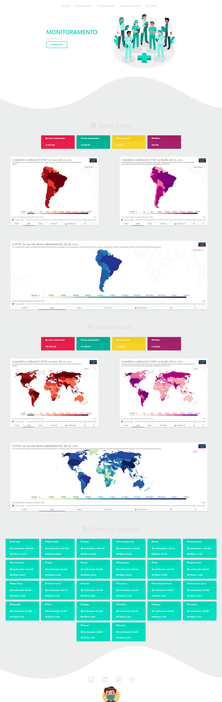

<h1 align="center">😷 Monitoramento COVID-19</h1>

  <strong>Dados atualizados do Brasil e do Mundo do coronavírus 2019 (COVID-19)</strong>

  

## API's: 📊

- [Global Coronavirus information](https://coronavirus-19-api.herokuapp.com/)
- [Covid19 Brazil](https://covid19-brazil-api-docs.now.sh/)

### Site 💻

- [Monitoramento COVID-19](https://monitoramento-v2.netlify.app/)

## Linguagens: 🚀
- HTML
- CSS
- JavaScript
- Consumo de API
